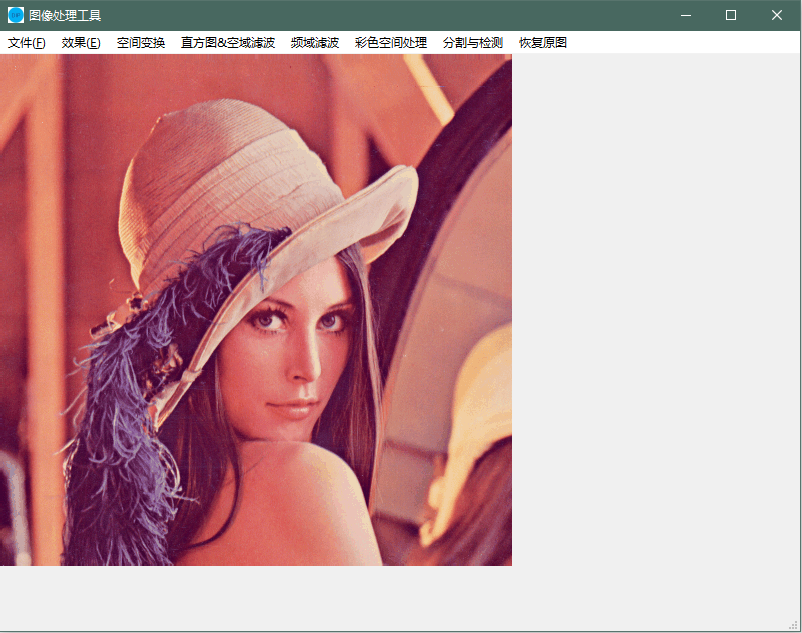

# ImageProcessingTools
基于Qt 5.11.0和OpenCV 3.4.1的中文图像处理工具

## 依赖环境
Windows 64位系统

[Qt 5.11.0](https://wiki.qt.io/Qt_5.11_Release)

[OpenCV 3.4.1](https://opencv.org/opencv-3-4-1.html)

## 功能列表
+ 文件（新建、读取、保存）
+ 效果（转换为灰度图、添加噪声）
+ 空间变换（降低分辨率、改变灰度级、图像差分、叠加去噪）
+ 直方图&空域滤波（直方图操作、几种空域滤波）
+ 频域滤波（FFT、三种频域滤波器）
+ 彩色空间处理（显示各分量、图像均衡、RGB分割）
+ 分割与检测（检测直线、图像分割）
+ 恢复原图

## 运行截图
